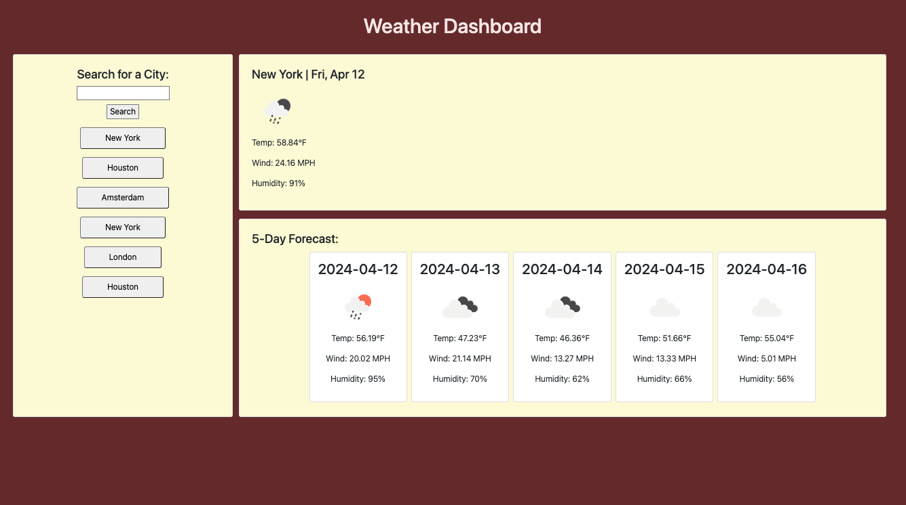

# Weather Dashboard

## Description

This is the project for Module 06 of the Rice FullStack Bootcamp. This prject displays my ability to work with APIs. It uses the Open Weather API to display the current weather and the 5 day forecast for a city entered in the search bar.

The project utilizes:

- Open Weather API
- Geocoding API
- Bootstrap
- JQuery
- Day.js

## Installation

Clone to local machine

## Usage

Enter a city in the search bar to display the current weather and the 5 day forecast

This is the link to the deployed webpage: https://anullator.github.io/Weather-Dashboard/
